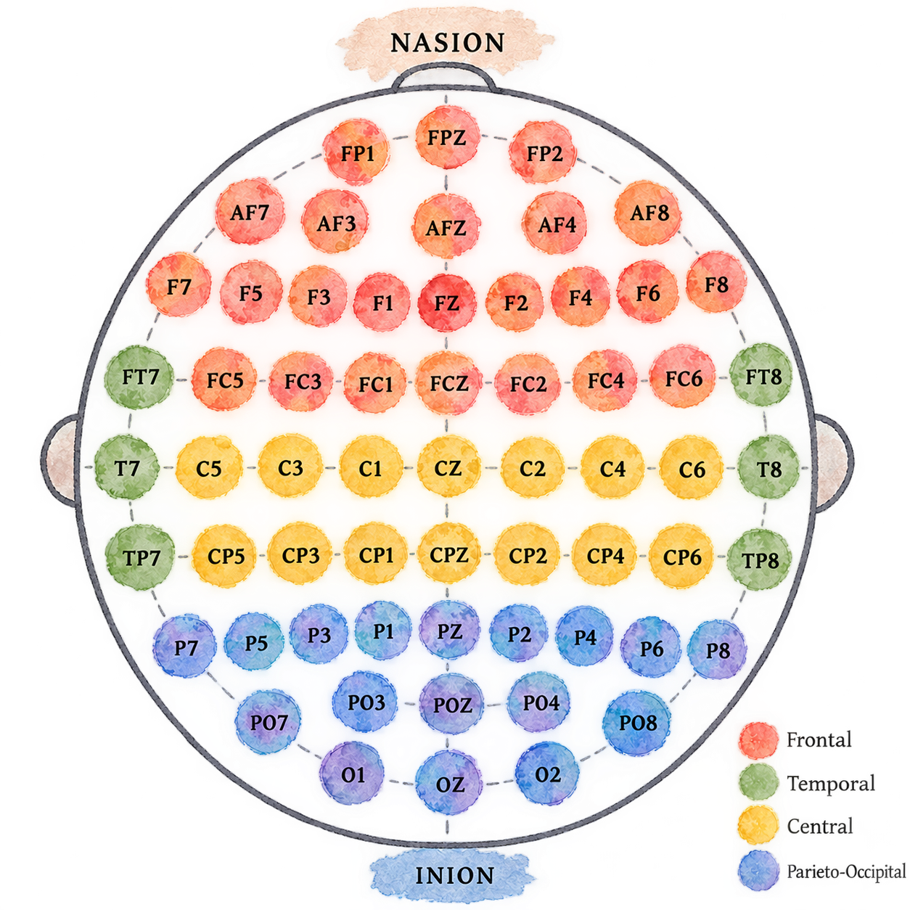

# Data Visualization of EEG and Sleep Deprivation Dataset

Dataset title: A Resting-state EEG Dataset for Sleep Deprivation

Source URL: https://openneuro.org/datasets/ds004902/versions/1.0.8

Organization or collector: Sleep and NeuroImaging Center, Faculty of Psychology, Southwest University, Chongqing, China. The dataset was collected by Chuqin Xiang, Xinrui Fan, Duo Bai, Ke Lv, and Xu Lei. :contentReference

Collection method: The dataset contains resting-state electroencephalography (EEG) recordings and behavioral/psychological measurements from 71 participants. Each participant completed two experimental conditions: Normal Sleep (NS) and Sleep Deprivation (SD), using a within-subject design with the order of conditions counterbalanced across participants. EEG was recorded using 61 Ag/AgCl electrodes arranged according to the extended 10–20 international electrode placement system. The standard sampling rate was 500 Hz. Participants completed eyes-open resting-state EEG recordings, and a subset of 38 participants also completed eyes-closed recordings. The dataset also includes behavioral measurements such as the Psychomotor Vigilance Task (PVT), mood and sleepiness scales, and sleep-quality and personality-related questionnaires. :contentReference[oaicite:2]{index=2}

Geographic coverage: Data were collected at the Sleep and NeuroImaging Center, Southwest University, Chongqing, China. The participants were recruited from this research setting.

Temporal coverage: Data collection was conducted from March 2019 to October 2021 according to the published Scientific Data article. The experimental sessions were separated by at least 7 days and at most one month. The sleep-deprivation condition involved approximately 24–30 hours of sleep deprivation.

Access date: September 1, 2026.

License or terms of use: The OpenNeuro dataset is released under CC0 (Creative Commons Zero), meaning that the dataset is dedicated to the public domain to the extent permitted by law. The associated Scientific Data article is published under a CC BY 4.0 license. Users should still provide appropriate attribution to the dataset authors and associated publication when using the data. :contentReference[oaicite:5]{index=5}

## Overview

This dataset contains EEG (electroencephalography) recordings collected from participants under two sleep conditions:

- **Normal Sleep (NS):** participants had a normal night's sleep.
- **Sleep Deprivation (SD):** participants were deprived of sleep.

In addition to EEG recordings, the dataset contains demographic information, cognitive performance measurements, sleepiness assessments, emotional state measurements, and sleep-quality questionnaires.

This combination makes it possible to study how **sleep deprivation affects brain activity, alertness, cognitive performance, emotions, and subjective sleepiness**.

Data can be obtained from the OpenNeuro repository: [https://github.com/OpenNeuroDatasets/ds004902](https://github.com/OpenNeuroDatasets/ds004902)

---

# 1. Basic Participant Information

| Variable | Description |
|---|---|
| `participant_id` | Unique identifier assigned to each participant. |
| `Gender` | Participant's biological sex, recorded as `F` (female) or `M` (male). |
| `Age` | Participant's age in years. |
| `SessionOrder` | Indicates the order in which the participant completed the two experimental sessions. |

### SessionOrder

| Value | Meaning |
|---|---|
| `NS->SD` | The participant completed the Normal Sleep session first and the Sleep Deprivation session second. |
| `SD->NS` | The participant completed the Sleep Deprivation session first and the Normal Sleep session second. |

The session order is important because it allows researchers to investigate whether the order in which the conditions were experienced could influence the results.

---

# 2. EEG Sampling Times

### What is EEG?

**EEG = Electroencephalography**

EEG is a technique used to record electrical activity produced by the brain. Electrodes placed on the scalp measure changes in electrical potential over time.

Unlike a questionnaire, which might give us one score per participant, EEG produces a large amount of time-dependent data from multiple electrodes.

| Variable | Description |
|---|---|
| `EEG_SamplingTime_Open_NS` | Time of day when the eyes-open EEG recording was collected during the Normal Sleep condition. |
| `EEG_SamplingTime_Closed_NS` | Time of day when the eyes-closed EEG recording was collected during the Normal Sleep condition. |
| `EEG_SamplingTime_Open_SD` | Time of day when the eyes-open EEG recording was collected during the Sleep Deprivation condition. |
| `EEG_SamplingTime_Closed_SD` | Time of day when the eyes-closed EEG recording was collected during the Sleep Deprivation condition. |

Electrodes were placed on the scalp according to the extended 10–20 international electrode placement system. The dataset contains EEG recordings from 61 electrodes following this diagram:

Voltage difference was measured between each electrode and reference electrode **FCz**. The EEG signals were recorded at a sampling rate of 500 Hz, meaning that 500 measurements were taken per second for each electrode.

### Open vs. Closed

- **Open:** participant's eyes were open during the EEG recording.
- **Closed:** participant's eyes were closed during the EEG recording.

This distinction is useful because brain activity can differ depending on whether a person has their eyes open or closed.

---

# 3. PVT — Psychomotor Vigilance Task

**PVT = Psychomotor Vigilance Task**

The PVT is a test of **attention and alertness**. Participants respond as quickly as possible to a visual stimulus.

It is commonly used to study whether sleep deprivation affects a person's ability to remain alert and respond quickly.

The dataset contains three PVT measurements for each sleep condition.

### PVT measurements

| Variable | Description |
|---|---|
| `PVT_item1_NS` | Number of lapses (very slow or missed responses) after Normal Sleep. |
| `PVT_item2_NS` | Median reaction time after Normal Sleep. |
| `PVT_item3_NS` | Standard deviation of reaction time after Normal Sleep. |
| `PVT_item1_SD` | Number of lapses after Sleep Deprivation. |
| `PVT_item2_SD` | Median reaction time after Sleep Deprivation. |
| `PVT_item3_SD` | Standard deviation of reaction time after Sleep Deprivation. |

These variables can help answer questions such as:

> Does sleep deprivation make people respond more slowly?

> Does sleep deprivation increase the number of times participants fail to respond quickly?

> Do participants become more variable in their reaction times?

---

# 4. PANAS — Positive and Negative Affect Schedule

**PANAS = Positive and Negative Affect Schedule**

PANAS is a questionnaire used to measure a person's **emotional state**.

It has two main dimensions:

- **Positive Affect (PA):** reflects positive emotional states such as enthusiasm, energy, and alertness.
- **Negative Affect (NA):** reflects negative emotional states such as distress, irritability, or discomfort.

| Variable | Description |
|---|---|
| `PANAS_P_NS` | Positive Affect score after Normal Sleep. |
| `PANAS_P_SD` | Positive Affect score after Sleep Deprivation. |
| `PANAS_N_NS` | Negative Affect score after Normal Sleep. |
| `PANAS_N_SD` | Negative Affect score after Sleep Deprivation. |

These variables allow researchers to explore whether sleep deprivation is associated with changes in emotional state.

---

# 5. ATQ — Adult Temperament Questionnaire

**ATQ = Adult Temperament Questionnaire**

The ATQ is a questionnaire designed to measure different characteristics of a person's **temperament**.

Temperament refers to relatively stable patterns in how people tend to respond emotionally and behaviorally.

| Variable | Description |
|---|---|
| `ATQ_NS` | Overall ATQ score after Normal Sleep. |
| `ATQ_SD` | Overall ATQ score after Sleep Deprivation. |

These measurements can be used to explore whether participants' reported temperament-related characteristics differ between the two experimental conditions.

---

# 6. SAI — State Anxiety Inventory

**SAI = State Anxiety Inventory**

The SAI measures **state anxiety**, meaning how anxious a person feels at a particular moment.

This is different from measuring a person's general tendency to experience anxiety.

| Variable | Description |
|---|---|
| `SAI_NS` | SAI score after Normal Sleep. |
| `SAI_SD` | SAI score after Sleep Deprivation. |

This allows researchers to investigate whether sleep deprivation is associated with changes in momentary anxiety.

---

# 7. SSS — Stanford Sleepiness Scale

**SSS = Stanford Sleepiness Scale**

The SSS measures **subjective sleepiness** — in other words, how sleepy or alert a person feels at a particular moment.

| Variable | Description |
|---|---|
| `SSS_NS` | SSS score after Normal Sleep. |
| `SSS_SD` | SSS score after Sleep Deprivation. |

This is particularly useful when studying sleep deprivation because it provides a measure of how sleepy participants **feel**, rather than only measuring their behavior or brain activity.

---

# 8. KSS — Karolinska Sleepiness Scale

**KSS = Karolinska Sleepiness Scale**

The KSS is another questionnaire used to measure **subjective sleepiness and alertness**.

| Variable | Description |
|---|---|
| `KSS_NS` | KSS score after Normal Sleep. |
| `KSS_SD` | KSS score after Sleep Deprivation. |

The dataset therefore contains two different measures of subjective sleepiness:

- **SSS — Stanford Sleepiness Scale**
- **KSS — Karolinska Sleepiness Scale**

This makes it possible to compare whether the two measures show similar patterns.

---

# 9. Sleep Diary

The Sleep Diary contains information reported by participants about their previous night's sleep.

| Variable | Description |
|---|---|
| `SleepDiary_item1_NS` | Time the participant went to bed the previous night before the Normal Sleep condition. |
| `SleepDiary_item2_NS` | Time the participant got out of bed the morning before the Normal Sleep condition. |
| `SleepDiary_item3_NS` | Participant's reported sleep quality after the Normal Sleep condition. |

These variables provide additional context about participants' sleep.

---

# 10. EQ — Empathy Quotient

**EQ = Empathy Quotient**

The Empathy Quotient is a questionnaire designed to measure **empathy-related characteristics**.

| Variable | Description |
|---|---|
| `EQ` | Overall Empathy Quotient score of the participant. |

Unlike measurements such as KSS or PVT, which are collected under the two experimental conditions, this is a participant-level characteristic.

---

# 11. Buss–Perry Aggression Questionnaire

The **Buss–Perry Aggression Questionnaire** is a psychological questionnaire used to measure different aspects of **aggression-related traits**.

| Variable | Description |
|---|---|
| `Buss_Perry` | Overall Buss–Perry questionnaire score of the participant. |

This provides information about individual differences between participants.

---

# 12. PSQI — Pittsburgh Sleep Quality Index

**PSQI = Pittsburgh Sleep Quality Index**

The PSQI is a questionnaire used to evaluate **sleep quality and sleep-related problems**.

The dataset contains both an overall PSQI score and scores for seven individual components.

### Overall score

| Variable | Description |
|---|---|
| `PSQI_GlobalScore` | Overall PSQI score of the participant. |

### Individual PSQI components

| Variable | Description |
|---|---|
| `PSQI_item1` | Subjective sleep quality — how the participant generally rates their sleep quality. |
| `PSQI_item2` | Sleep latency — how long it takes the participant to fall asleep. |
| `PSQI_item3` | Sleep duration — how long the participant sleeps. |
| `PSQI_item4` | Sleep efficiency — how efficiently the participant's time in bed is converted into actual sleep. |
| `PSQI_item5` | Sleep disturbances — problems or interruptions affecting sleep. |
| `PSQI_item6` | Use of sleep medication. |
| `PSQI_item7` | Daytime dysfunction — difficulties during the day associated with poor sleep. |

These variables provide information about participants' **habitual sleep quality**, rather than only their sleepiness during the experimental sessions.

---

# 13. Important Abbreviations

For convenience, the main abbreviations in the dataset are:

| Abbreviation | Full name | What it measures |
|---|---|---|
| **EEG** | Electroencephalography | Electrical activity of the brain |
| **PVT** | Psychomotor Vigilance Task | Attention, alertness, and reaction time |
| **PANAS** | Positive and Negative Affect Schedule | Positive and negative emotional states |
| **ATQ** | Adult Temperament Questionnaire | Temperament characteristics |
| **SAI** | State Anxiety Inventory | Anxiety at a particular moment |
| **SSS** | Stanford Sleepiness Scale | Subjective sleepiness |
| **KSS** | Karolinska Sleepiness Scale | Subjective sleepiness/alertness |
| **EQ** | Empathy Quotient | Empathy-related characteristics |
| **PSQI** | Pittsburgh Sleep Quality Index | Sleep quality and sleep-related problems |
| **NS** | Normal Sleep | Experimental condition following normal sleep |
| **SD** | Sleep Deprivation | Experimental condition following sleep deprivation |

---

# 14. What Can Be Studied With These Data?

The dataset combines several different types of information:

### Brain activity
**EEG**

### Cognitive performance
**PVT**

### Subjective sleepiness
**SSS, KSS**

### Emotional state
**PANAS**

### Anxiety
**SAI**

### Sleep quality
**PSQI, Sleep Diary**

### Individual characteristics
**Age, Gender, EQ, Buss–Perry, ATQ**

### Experimental conditions
**Normal Sleep vs. Sleep Deprivation**

This makes it possible to explore questions such as:

- How does sleep deprivation affect brain activity?
- Which EEG patterns change after sleep deprivation?
- Does increased sleepiness correspond to changes in EEG activity?
- Does sleep deprivation affect reaction time and attention?
- Are participants who become more sleepy also more impaired in the PVT?
- Is sleep deprivation associated with changes in positive or negative affect?
- Do participants respond differently to sleep deprivation?
- Are habitual sleep quality and individual characteristics related to the effects of sleep deprivation?
- Do EEG patterns associated with sleep deprivation differ between participants?

---

# 15. Why This Dataset Is Interesting for Data Visualization

Why the dataset is potentially useful for visualization: This dataset is particularly suitable for interactive data visualization because it combines multiple types of information about the same participants. It includes high-dimensional EEG recordings, which describe brain electrical activity over time and across 61 electrodes, together with behavioral, psychological, sleepiness, mood, and sleep-quality measurements. The two experimental conditions (Normal Sleep and Sleep Deprivation) also provide a natural basis for comparison.

The combination of these variables makes it possible to explore relationships between brain activity and human behavior. For example, visualization could be used to investigate how EEG activity changes after sleep deprivation, whether participants with greater subjective sleepiness show different EEG patterns, and whether changes in brain activity are associated with changes in attention or reaction time measured by the PVT.

The dataset is also well suited to interactive techniques such as brushing and linking. A user could select participants with high sleepiness scores, for example, and simultaneously examine their EEG signals, electrode activity, frequency characteristics, and behavioral measurements. This allows researchers to explore temporal, spatial, physiological, behavioral, and individual-level patterns together rather than examining each variable independently.

Dataset characteristics relevant to visualization: 71 participants, 218 EEG recordings, 61 EEG channels, approximately 18.1 hours of recordings, two experimental sessions/conditions, and both EEG and behavioral data. The dataset follows the BIDS 1.8.0 standard and is publicly distributed through OpenNeuro.