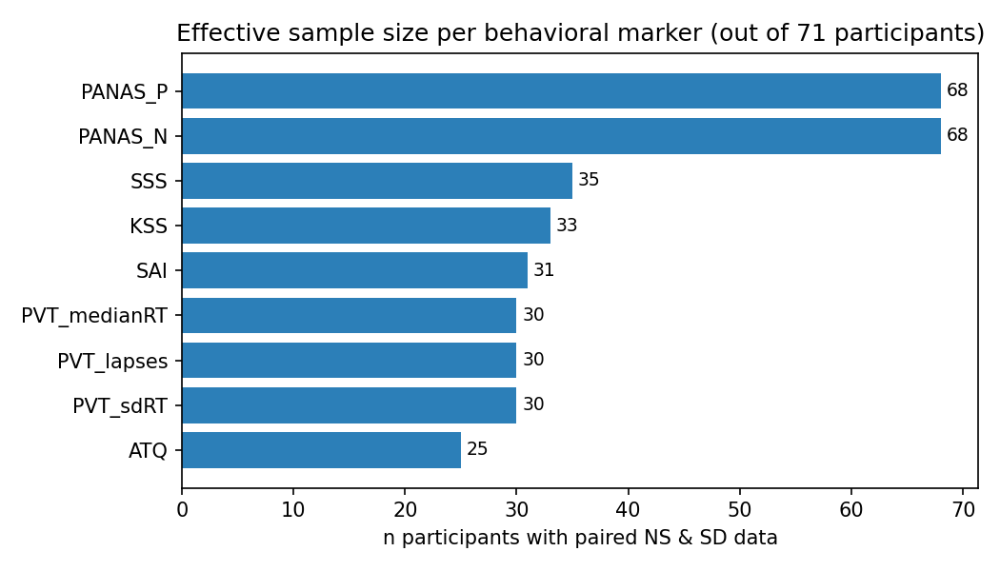
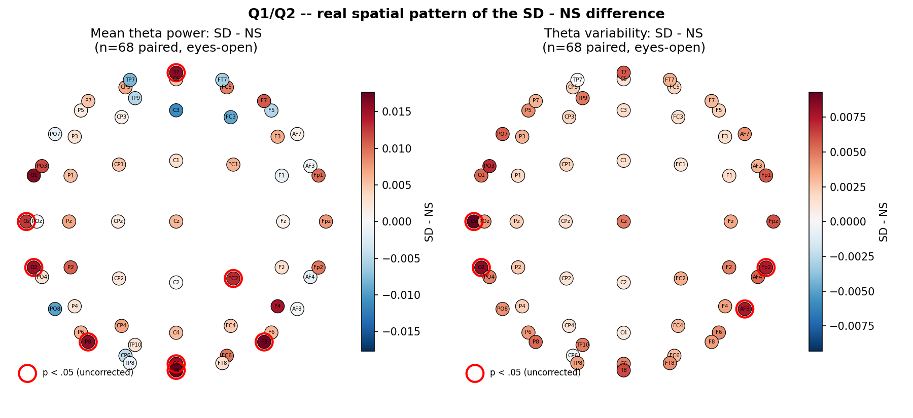
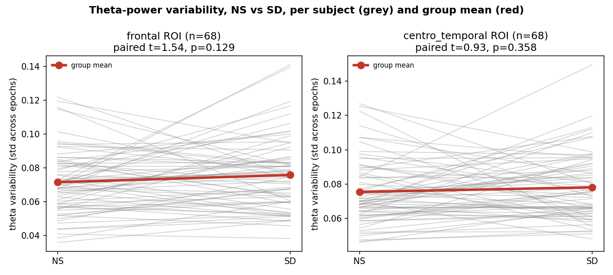
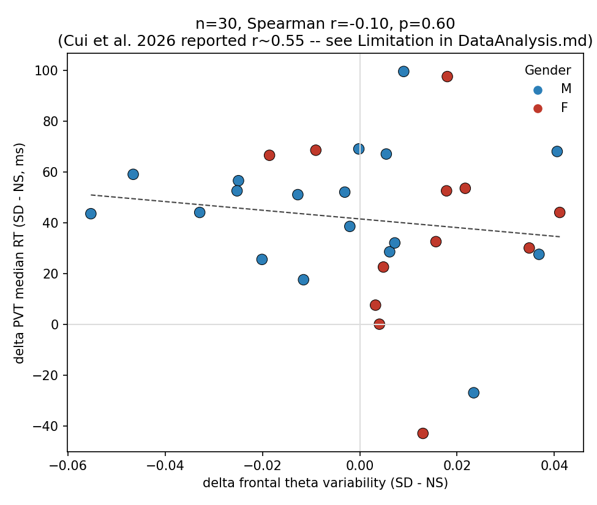
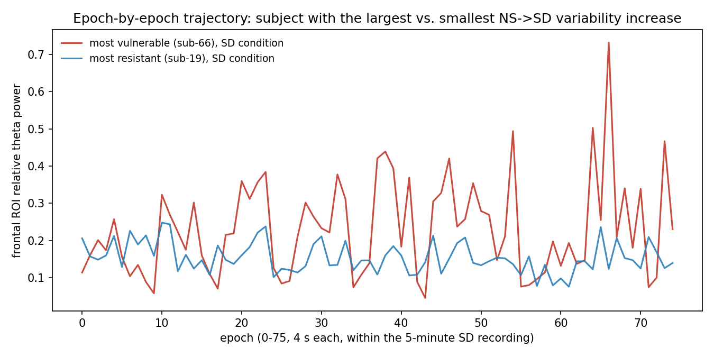

# Week 6 -- Data Analysis and Sketches

This delivery demonstrates, on real data, that the processing flow proposed in
`deliveries/week05/ProjectProposal.tex` (Section 4) actually runs end to end
for all three planned D3.js views, and documents what changed once we ran it
against the full dataset instead of a single sample subject.

## 1. What's new since Week 5

Week 5 described the pipeline; it had only been exercised on a single sample
subject (`sub-01`, committed in `deliveries/week04/data/sample/`). For Week 6
we:

1. Downloaded the full ds004902 dataset (~8.3 GB, 218 recordings) via
   `deliveries/week04/acquisition.md`'s AWS S3 instructions (the GitHub
   git-annex mirror only contains pointer files, not the actual signal --
   see Limitation 5.1 below).
2. Implemented and ran both pipelines from the proposal on the real data
   (not pseudocode): `code/01_behavioral_pipeline.ipynb` and `code/02_eeg_pipeline.ipynb`,
   joined by `code/03_merge_pipeline.ipynb`.
3. Produced a first, honest look at whether the core hypothesis (theta-power
   *variability* separates NS from SD better than the mean does) survives
   contact with the full 71-subject dataset, as **real charts** computed from
   our own processed data (`code/05_findings_plots.ipynb` -> `analysis_plots/`,
   Section 4).
4. Reviewed six design-inspiration papers (`reviewed_papers/README.md`);
   hand-drawn sketches for the three views are still pending (Section 6).

**Quick map of what's where**, since preprocessing/findings/charts each live
in a different place by design (data pipeline vs. exploratory output vs. UI
mock-up):

| Question | Where |
|---|---|
| What did we do to the raw data? | Section 3 below (+ the code cells in `code/01`-`03`) |
| What did we find? | Section 4 below (text) + `analysis_plots/*.png` (charts, generated by `code/05_findings_plots.ipynb`) |
| What will the final D3 app look like? | pending -- see Section 6 |
| What data quality problems exist? | Section 5 (Limitations) |

## 2. Data understanding (recap + additions)

Source, license, and variable-level documentation are in
`deliveries/week04/README.md` and `data_dictionary.csv`; the study design and
domain questions are in `deliveries/week05/ProjectProposal.tex`. New in Week 6:

- **218 recordings confirmed present** after the full download (matches the
  Week 4 EDA count exactly), of which **213 (97.7%) were processed
  successfully** by `02_eeg_pipeline.ipynb`; 5 failed with a sample-count mismatch
  between the `.set` header and the `.fdt` binary (see Limitation 5.2).
- **139 eyes-open + 74 eyes-closed** recordings among the successfully
  processed ones. All downstream cross-subject comparisons in this report use
  **eyes-open only**, since it is the condition available for all 71
  participants (eyes-closed is a 38-subject subset).
- **35 of 213 recordings (16%) required at least one bad-channel
  interpolation** (max 3 of 61 channels in a single recording), using a
  simple log-variance z-score rule (`|z| > 3`); this is a first-pass heuristic,
  not the ICA-based artifact rejection a publication would use (Limitation
  5.3).
- **8 of 213 recordings yielded fewer than 75 epochs** (as low as 59), because
  their actual recorded duration was short of 300 s -- consistent with the
  `RecordingDuration` inconsistency already flagged in the Week 4 EDA.

## 3. Transformations

### 3.1 Behavioral pipeline (`code/01_behavioral_pipeline.ipynb`)

`participants.tsv` &rarr; parse `n/a` &rarr; for each NS/SD marker pair,
keep only subjects with **both** values present &rarr; derive
`delta_<marker> = SD - NS` &rarr; `data/processed/behavioral_deltas.csv` (71
rows, one per participant) + `data/processed/paired_n_summary.csv`.

Paired-n reproduced exactly what the Week 5 proposal reported from manual EDA
(validates that proposal's numbers against a scripted, reproducible pipeline):

| marker | n paired (NS & SD) |
|---|---|
| PANAS_N / PANAS_P | 68 |
| SSS | 35 |
| KSS | 33 |
| SAI | 31 |
| PVT (lapses / median RT / SD RT) | 30 |
| ATQ | 25 |

Sample (`behavioral_deltas.csv`, first 2 columns of interest):

```
participant_id Gender  ... delta_PVT_medianRT  delta_PANAS_N  delta_KSS
sub-01         M       ...  NaN                 1.0            NaN
sub-02         M       ...  28.5                 NaN            NaN
sub-03         F       ...  44.0                 7.0            NaN
```

### 3.2 EEG pipeline (`code/02_eeg_pipeline.ipynb`)

Raw BIDS `.set`/`.fdt` (61 ch, 500 Hz) &rarr; **cleaning** (50 Hz notch,
1-40 Hz band-pass, log-variance bad-channel detection + spherical-spline
interpolation) &rarr; **segmentation** (fixed-length 4 s epochs, capped at 75)
&rarr; **feature extraction** (Welch PSD per epoch/electrode, relative theta
power = &int;<sub>4-8Hz</sub>PSD / &int;<sub>1-40Hz</sub>PSD) &rarr;
**aggregation**, written as two files:

- `eeg_theta_per_electrode.csv` (12,993 rows = 213 recordings &times; 61
  electrodes): mean + std of relative theta power across epochs, per
  electrode -- feeds the **topomap view**.
- `eeg_theta_epochs_roi.csv` (47,733 rows): per-epoch relative theta power
  averaged within each ROI (frontal / centro-temporal / other) -- feeds the
  **intra-recording dynamics view**.

ROI membership (`FRONTAL_ROI`, `CENTROTEMPORAL_ROI` in the script) was
cross-checked against the actual 61 channel names in ds004902 and matches the
16 frontal / 28 centro-temporal counts reported by Cui et al. (2026) exactly.

Sample (`eeg_theta_per_electrode.csv`):

```
electrode  theta_mean  theta_std  participant_id condition task
Fp1        0.2979      0.1172     sub-01          NS       eyesclosed
AF3        0.2933      0.1306     sub-01          NS       eyesclosed
AF7        0.2813      0.1034     sub-01          NS       eyesclosed
```

### 3.3 Merge (`code/03_merge_pipeline.ipynb`)

Per subject/condition, average `theta_mean` and `theta_std` across the
electrodes in each ROI (eyes-open only) &rarr; pivot NS/SD to columns &rarr;
derive `delta_<roi>_theta_power` and `delta_<roi>_theta_variability` &rarr;
outer-join with `behavioral_deltas.csv` on `participant_id` &rarr;
`data/processed/merged_summary.csv` (71 rows). This is the table Paolo's
vulnerability-scatter view (Q3, Q5, Q7) reads directly; the topomap and
temporal views read the more granular per-electrode / per-epoch files instead.

## 4. Initial exploratory findings

All charts below are generated from our real processed data by
`code/05_findings_plots.ipynb` and saved to `analysis_plots/`. They are a
first analytical look, not the final D3 views (compare with the wireframes
in Section 6, which show *layout*, not *results*).

### 4.1 Effective n per marker



All 71 subjects have usable eyes-open EEG in at least one condition; 68 have
it in **both** NS and SD (3 lost to the corrupted-file issue, Limitation
5.2). Behavioral markers range from n=68 (PANAS) down to n=25 (ATQ) -- this
is why every view that touches a behavioral marker must display its
effective n, not just its finding.

### 4.2 Q1/Q2 -- real spatial pattern, with significance



Per-electrode paired difference (SD - NS) averaged over n=68 subjects, red
circles marking electrodes where a paired t-test gives p < .05
(uncorrected -- exploratory). **8 of 61 electrodes are significant for mean
theta power, but only 4 of 61 for theta variability** -- the opposite of
what the proposal's premise predicted (variability should be the *more*
sensitive marker). The significant mean-power electrodes (T8, C6, Oz, T7,
O2, P8, FC2, F8) are mostly temporal/occipital/parietal, not the
frontal/centro-temporal ROI that Cui et al. (2026) and our proposal expected
to be the main story. Read cautiously (uncorrected for multiple comparisons
across 61 electrodes, first-pass artifact handling -- Limitation 5.3), but
this is exactly the kind of pattern an interactive topomap should let a
reader discover directly, and it directly motivated the "difference +
significance" encoding mode adopted from the aperiodic-activity paper (see
`reviewed_papers/README.md`, #1) -- our Week 5 plan only had raw NS/SD/mean/
variability toggles, not a difference-with-significance mode.

### 4.3 Group-level NS vs SD, by ROI (the "why individuals, not averages" check)



| ROI | metric | mean NS | mean SD | paired t | p |
|---|---|---|---|---|---|
| frontal | variability (std across epochs) | 0.0714 | 0.0757 | 1.54 | 0.129 |
| centro-temporal | variability | 0.0755 | 0.0782 | 0.93 | 0.358 |

Directionally consistent with the proposal's premise (variability increases
under SD), but **not statistically significant at the group level** (n=68).
The chart shows why: individual grey lines cross in both directions far more
than the group-mean (red) line moves. This group-level null result is
expected, not a bug -- it is Van Dongen et al. (2004)'s point (averaging
dilutes a real but individually concentrated effect), and it is the direct
justification for the project's per-subject, linked-brushing design over a
static bar/box plot.

### 4.4 Q3 -- vulnerability scatter with real data



n=30, Spearman &rho; = -0.10 (p = 0.60) -- our first-pass pipeline does
**not** yet reproduce Cui et al. (2026)'s reported &rho; &asymp; 0.55. This is
flagged, not hidden: our bad-channel handling, PSD windowing, and exact
ROI-averaging differ from theirs in ways we have not yet matched
line-for-line, and n=30 is small. Before Week 7 we will re-check this
against their Methods section in detail; if it doesn't converge, Q3/Q5's
framing may need to shift from "validate this specific correlation" to "let
the user look for it/its absence directly."

### 4.5 Q6 -- real intra-recording trajectories



Plotting the two subjects at the extremes of `delta_frontal_theta_variability`
(rather than the smooth fake curves in the Section 6 wireframe) is a useful
gut-check on whether our variability metric reflects genuine epoch-to-epoch
fluctuation or a few outlier epochs. Worth re-inspecting per-subject before
Week 10 if a trajectory looks implausibly spiky.

## 5. Limitations

1. **git-annex vs. S3 acquisition path.** The Week 4 sample committed to
   `deliveries/week04/data/sample/` contains git-annex pointer files, not
   real EEG signal, for the `.set`/`.fdt` binaries (confirmed: 205-byte text
   files starting with `../../../.git/annex/objects/...`). `acquisition.md`'s
   AWS S3 instructions are the only path that yields real data; anyone
   re-cloning the repo needs to run that step, not `git clone` on the
   GitHub mirror.
2. **5 recordings (2.3%) are corrupted at the source**, not just
   metadata-inconsistent: the `.fdt` binary has fewer samples than the
   `.set` header declares (`sub-01`, `sub-03`, `sub-28` x2, `sub-44`). These
   are excluded, not imputed; `data/processed/eeg_pipeline_skipped.csv` lists
   them with the exact error.
3. **Bad-channel detection is a placeholder heuristic** (log-variance
   z-score), not the ICA/RANSAC pipeline a publication-grade analysis would
   use. It is good enough to demonstrate the full flow but should be
   revisited before Week 10 if the topomap looks noisy at specific
   electrodes.
4. **ROI list is inferred, not copy-pasted from Cui et al. (2026)** -- we
   matched their reported *counts* (16 / 28) using standard 10-20 naming
   prefixes, which happened to match exactly, but we have not confirmed
   their exact electrode-by-electrode list from the paper's Methods/appendix.
5. **The theta-variability vs. PVT correlation does not yet replicate**
   Cui et al.'s effect size (Section 4) -- treat Q3/Q5 as exploratory, not as
   a foregone conclusion, until this is resolved.
6. **Effective n varies sharply by question**, as already flagged in the
   proposal: Q1/Q2 (topomap) run on up to 71 subjects; Q3/Q5 (PVT/KSS
   convergence) drop to 30/33; Q7 (moderators) inherits whichever n the
   marker being moderated has. Each view must keep showing its n visibly.
7. **The per-electrode significance markers in Section 4.2 are uncorrected**
   for multiple comparisons (61 electrodes tested independently) -- with
   &alpha;=.05 uncorrected we'd expect ~3 false positives by chance alone,
   so the observed 8 (mean power) / 4 (variability) are only modestly above
   that noise floor. Before treating the topomap's significance overlay as a
   real finding rather than a design placeholder, apply an FDR/cluster
   correction.

## 6. Sketches and design rationale

Hand-drawn sketches for the three views are **pending** -- each owner still
needs to sketch their own view before Week 7. The encoding/interaction
rationale for each is already settled enough to sketch from:

- **View 1 -- topomap (Q1, Q2), Jimena.** Encodes relative theta
  power/variability as electrode color (sequential/diverging scale TBD) over
  the true 2D projection of the 61 electrode positions. NS/SD and
  mean/variability toggles switch the bound data, not the chart type, so the
  scale and layout stay stable for comparison. Justified by Cui et al.'s
  topomap figures and, specifically, by the aperiodic-activity paper's
  difference-map-with-significance figure (see `reviewed_papers/README.md`,
  #1-2) -- the real chart in Section 4.2 is our first pass at that exact
  encoding, and it should become a fourth toggle mode ("difference") in the
  real D3 view, not just NS/SD/mean/variability as originally scoped in
  Week 5.
- **View 2 -- intra-recording dynamics (Q6, Q7), Andrea.** One line per
  subject (or per group after moderator filtering) over the 75 epochs of a
  single recording; brushing an epoch range is the mechanism for Q6
  (intra-recording trend). Moderator chips (sex, age, PSQI, session order)
  filter which lines are drawn. Line/small-multiples chosen over a single
  aggregated trend line for the same Van-Dongen-style reason as Section 4.
- **View 3 -- vulnerability scatter (Q3, Q4, Q5), Paolo.** Delta theta
  variability (x) vs. delta behavioral marker (y), one marker active at a
  time (PVT/KSS/PANAS-PA tabs, each showing its own n) since no three-way
  paired intersection exists (Section 4, proposal). This scatter is the
  brush *source* for Views 1 and 2.

(`code/04_make_sketches.ipynb` exists in the repo as a programmatic wireframe
generator built while drafting this rationale; its output is not included in
this delivery in favor of real hand-drawn sketches from each owner.)

## 7. Reviewed papers

See `reviewed_papers/README.md` -- sourced from the team's own design
research, not a generic literature search. **6 papers**, each with a
specific encoding/interaction takeaway
(not just domain background): the aperiodic-activity paper's difference-map-
with-significance topomap (directly adopted, Section 4.2), Cui et al.'s
epoching/ROI scheme, Bai et al.'s temporal framing, a parallel-coordinates
paper (candidate detail-on-demand view, not in the MVP), a connectivity
chord-diagram paper (candidate post-MVP extension), and the dataset paper's
electrode montage. PDFs included for all 6.

## 8. Revised questions / next steps for Week 7

- Q1-Q7 stand as written in the proposal; no question needs to be dropped.
- Before Week 7: (a) try to close the Cui et al. correlation gap (Section
  4.4), (b) apply an FDR/cluster correction to the topomap significance
  overlay before trusting it (Limitation 7), (c) replace the placeholder
  bad-channel heuristic if topomaps look noisy, (d) decide the topomap
  interpolation method (IDW vs. contour) and freeze the JSON schema the
  three views will actually read in D3, (e) hand-drawn sketches for the
  three views (Section 6).
